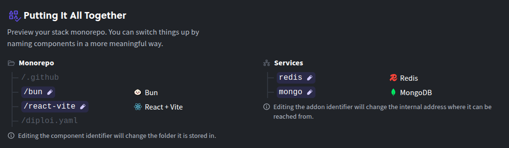
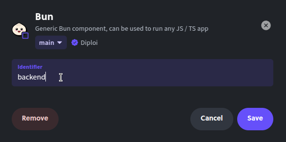
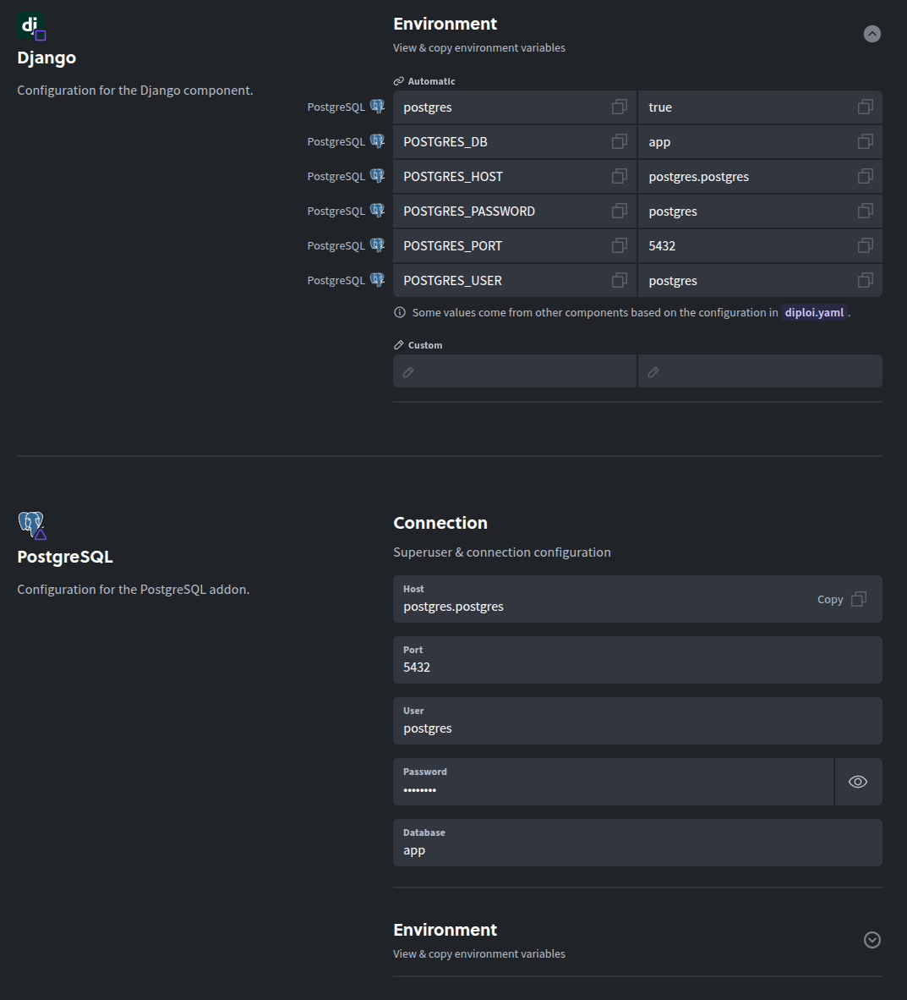

import ComponentList from  "../../../components/ComponentList.mdx"
import AddonList from  "../../../components/AddonList.mdx"

## What is a Diploi Project?

A Diploi project contains the deployments of your application. A typical setup could be one deployment for production, one for staging and perhaps one development instance per active developer.

A project is defined by the components and add-ons. A project also connects to a GitHub repository and contains common settings and environment variables.

***

## Creating a project

This is the first step to deploy a new application using Diploi. To create a project you must:

1. Select the components and add-ons that your application will be using
2. Choose between creating a new repository to store your application's code or quick launching without a repository associated for testing purposes

Every project is started from a set of components and add-ons you choose, which defines the structure of your project.

### Components

You can think of components as the application layer of your project. In Diploi you can have multiple options available to define your application, which you can mix as wish.

<ComponentList/>

### Add-ons

Now that you understand components, you might need a way to persist data or a way to perform pub/sub actions, which is where add-ons come in. Add-ons provide services that can be used by your application.

<AddonList/>

Depending on your combination of components and add-ons there might be some configurable options. E.g. if a database should be running, Redis enabled etc. Values provided in the project are defaults that you can override in the deployment.

***

### Previewing your project

In this section you can see a preview of your monorepo folder structure at root level.



:::note
From the preview, you can rename the folders that contain your components and the add-on names that your application will be using, by clicking on the element you want to edit

:::

### Choosing between creating a new repository or quick launch

The easiest way to set up a project is to let Diploi bootstrap a new GitHub repository for
you. This will ensure that the repository contains the right files to make the project run.

You can also create an project without a repository attached to it, but it is only intended to run tests.

:::caution
Once you choose between using a new repository or quick launching without a repository, you will not be able to change the repository or add a repository.
:::

### Using an existing repository

Alternatively you can create the project by connecting it to an existing repository. This can be
useful for example if you want to share a repository between multiple cores or projects, but we currently do not have an automagically way to do it. In this case, you are responsible for ensuring that the repository is set up for the chosen project type.

***

## Managing a project

After you create project you will be able to create new deployments and modify the options of the project.


### Project deployments

You will be able to create deployments. Each deployment represents a virtual machine that serves your application online and autoscales on demand. For a deeper dive on deployments, check [Concepts / Deployment](/concepts/deployment/).

### Project options

In this tab you can view and edit properties of your project.

#### General

From here you can update the project's name inside Diploi. When you launch new deployments, the new deployment's name will start by using the project's name.


:::note
If you update the name of your project, it won't affect the repository's name.
:::

#### Parent domain

By default, Diploi generates a domain for your application. The basic structure of a generated domain uses the following logic:

```
<Deployment endpoint>.<Project parent domain>.diploi.com
```


:::tip
If you want to setup a custom domain, you can do it from each deployment. For more information, click here [Guides / custom-domain](/guides/custom-domain/)
:::

#### Component and Add-on settings

You can view component specific settings and add-on configuration in this section.



:::note
Not all components and add-ons have editable or visible settings in this section.
:::

#### Deleting a project

When you no longer need a Project you can delete it by first deleting all deployments within the project and the going to the "options" tab of your projects and look for the actions sections, to delete the project click on the "delete project" button


