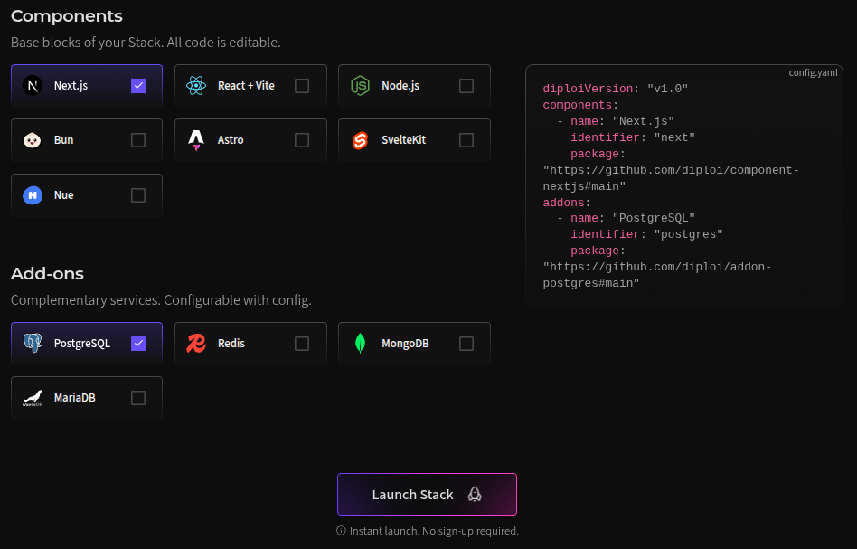

import { Image } from 'astro:assets';

## Ways to start using Diploi 

You have two ways to get started
* [**Quick launch**](#quick-launch) if you want only want to test drive Diploi and don't want to create an account just yet, or

* [**Dashboard launch**](#dashboard-launch) available when you create an account and gives you access to all features available in Diploi

Diploi uses Github to authenticate your account and it is where Diploi will create your deployment's repository 

***

### Quick launch

If you don't have an account Diploi, you can get started with an **quick launch**, this will create a deployment in which you can access directly using our browser IDE, connect remotely using VS code or connect directly to the remote server using SSH.

:::tip
No account or credit card needed!
:::

You can start a deployment right away by trying our quick launch demo server [directly from our homepage](https://diploi.com/#testid "directly from our homepage")

In the stack builder, you can can choose the components and add-ons you want to have in your deployment, and that's it!

You can click "**Launch stack**" and your deployment will be ready in less than 30 seconds.

Once the launch is complete, you will be able to connect to the remote server and you deployment will be accessible online with https.

:::tip
This deployment will be available for 1 hour, and after you are done testing, if you want to keep the deployment online, all you need to do is create an account by connecting your Github account, **no credit card required**.

:::

***

### Dashboard launch

When you create an account in Diploi, you get access to [the Diploi dashboard](https://console.diploi.com/ "to the Diploi dashboard") which allows you to create projects, where you can collaborate with your team, and create deployments from development, staging and production environments. To register, all you need is a Github account.

#### Prerequisites

* A GitHub account
* Text Editor - We recommend [VSCode](https://code.visualstudio.com/)
* An SSH Key (for development) - See [Add an SSH Key](/guides/add-ssh-key/)

#### Create an Account

To get started you need a Diploi account. Since Diploi is tightly integrated
with GitHub go to [console.diploi.com](https://console.diploi.com) and
authenticate using your GitHub account.

#### Create a Project

In Diploi, a project refer to a combination of **components** and **add-ons** that form the stack that will make up your application.

:::caution
Once you define the components and add-ons of your application, you won't be able to change it, so make sure to select the correct combination for your project
:::

To create a project for your app click **Create Project** from your dashboard, which will open the **Stack Builder** where you can choose the components and add-ons for your project.

##### Components

##### Add-ons

Once you have chosen the stack for your project, you will be able to see a preview of your selected stack.

##### Stack preview

In the preview you can edit the identifier for each component and add-on you have selected by clicking on the previewed elements of your stack. This will change the folder name of the components in your monorepo and the database name of your addons. 

##### Creating a repository to host you project

The last step before launching your project is to configure how your new application's code will be stored.

You have two options available:

- **Quick Launch** where you can launch a project without a repository to store your code. This is ideal for testing quick, where you will run simple scripts or applications which must be accessible online.

- **Create Repository** where a newly created repository is linked to your project. Ideal for launching new application intended for production. By creating a new repository for your project, you automagically enable Diploi's push-to-deployment pipeline, where changes in your repository's will update the state of your deployment.

Now that you have selected your desired stack and the configuration of your project, you can complete the creation of the project by clicking **Launch Stack**.

:::caution
**Quick Launch** projects are **not intended for production**, as your code will only exist on the deployment launched, and changes will not be persisted to other deployments you launch within the project.
:::

***

#### Launching a Deployment

To start a deployment, you have three different options:
- **Development** which allows you to start a server on which you can start a remote development environment using VSCode or our browser IDE, or connect directly to the server via SSH
- **Staging** to test your application and ensure stability before launching changes in your application to production
- **Production** to launch your application when it is ready to be used by your end users 

:::tip
If you need to connect via SSH to your staging or production deployment, you can do it by getting the SSH connection string from the "containers" section found at the bottom of the "Overview" tab of your deployment

:::

***

#### Shuting down a Deployment

If you want to stop a deployment from running, all you need to do is click on the "enabled" switch from the **Deployments** tab inside of your Project

Alternatively, you can also shutdown a deployment by clicking on the "enabled" switch found at the top of your Deployment's status page

You can restart your Deployment at any time by clicking on the same switch you used for shutdown

***

Now your application is ready to be used! If anything was unclear, feel free to ask directly on [Discord](https://discord.gg/YV6GYpbQRG) or [contact us](mailto:hello@diploi.com)