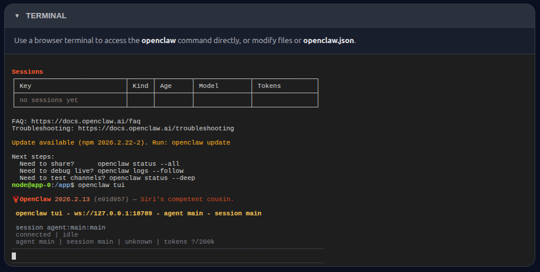
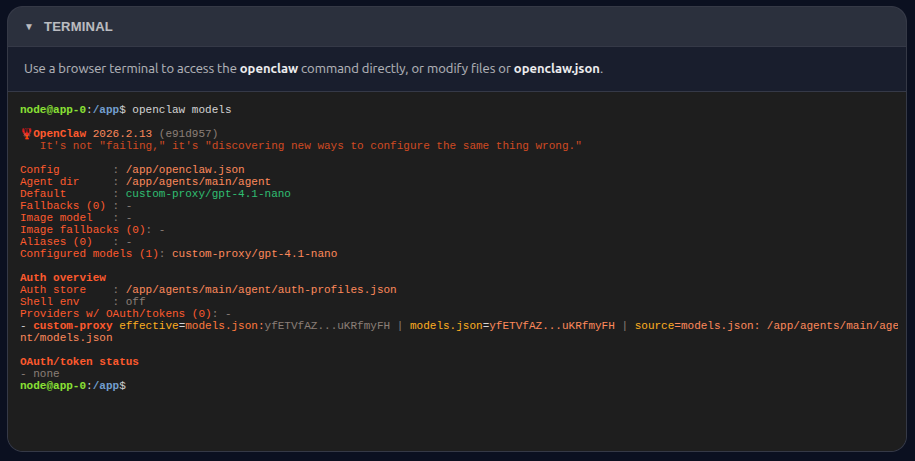
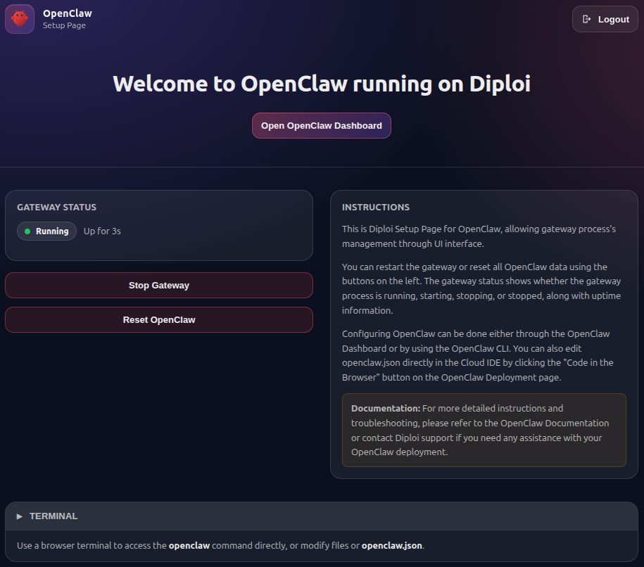

OpenClaw is an open-source, self-hosted personal AI assistant that connects to messaging platforms including WhatsApp, Telegram, Slack, Discord, Google Chat, Signal, Microsoft Teams, and more.

Use this starter kit when you want Diploi to run an OpenClaw instance without having to manually configure the hosting infrastructure for it.

Besides offering the easiest way to host OpenClaw on the cloud, Diploi has features that help you start even faster:

- Access to a browser terminal, to run CLI commands without requiring a SSH connection.

  

- Fully configured gpt-4.1-nano model, provided through the Diploi AI gateway.

  

<!-- more -->

## Tech stack

| Technology       | Role                                                      |
| ---------------- | --------------------------------------------------------- |
| **Node.js**      | Runtime                                                   |
| **TypeScript**   | Language                                                  |
| **Hono**         | Wrapper API server                                        |
| **React + Vite** | Control UI frontend                                       |
| **OpenClaw**     | AI assistant runtime                                      |
| **gpt-4.1-nano** | AI model, through the [AI Gateway](/reference/ai-gateway) |

## Key features

- **Multi-platform messaging** - WhatsApp, Telegram, Slack, Discord, Google Chat, Signal, Microsoft Teams, and more
- **Browser terminal** - Run OpenClaw CLI commands directly from the browser without SSH
- **Pre-configured AI model** - gpt-4.1-nano ready out of the box via the Diploi AI gateway
- **Custom control panel** - Welcome page to monitor status, start/stop the gateway, and reset your instance
- **API-driven management** - REST endpoints for programmatic control of the gateway
- **Self-hosted & open-source** - Full ownership of your data and infrastructure

## Control panel

Once launched, a welcome page unique to Diploi lets you:

- See the general status of your OpenClaw gateway
- Start/Stop the gateway globally
- Reset OpenClaw to its startup defaults
- Interact with the browser terminal and access the OpenClaw CLI
- Access the OpenClaw dashboard

The OpenClaw dashboard itself hasn't been modified, so you can expect the exact experience you would get if you configured OpenClaw manually. How the wrapper works, its API endpoints and environment variables are described in the readme below.
