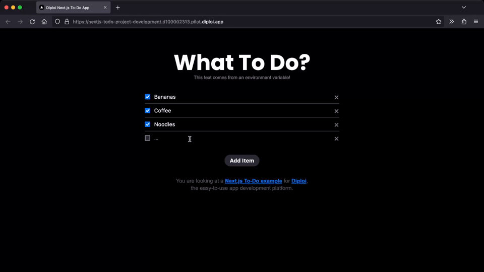
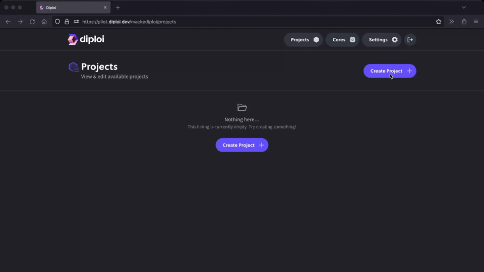
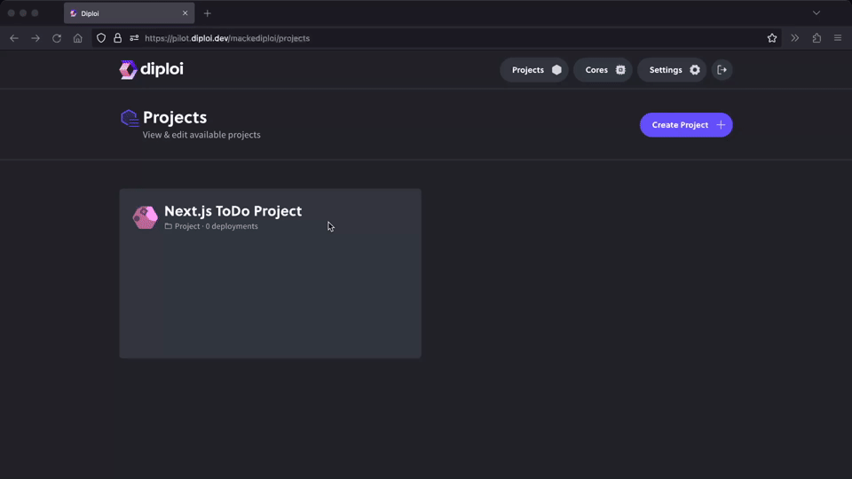
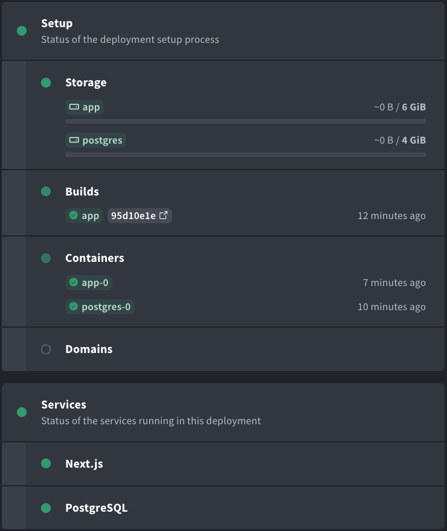
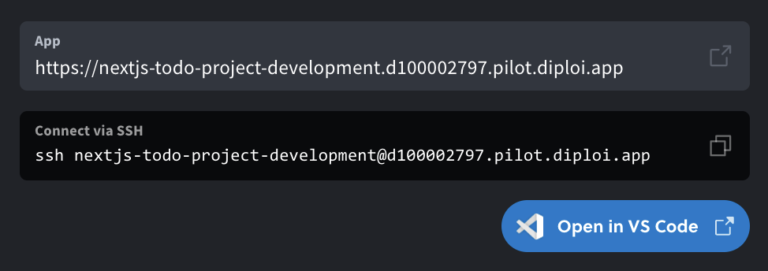

Ready to try out Diploi, this section will show how to set up a Next.js Todo List app together with a Postgresql database.

{/* <video style={{marginTop: "30px;"}} src="/GetStartedTodoApp.mp4" width="640" height="360" playsinline autoplay muted loop></video> */}

### Prerequisites

- A GitHub account
- Text Editor - We recommend [VSCode](https://code.visualstudio.com/)
- An SSH Key (for development) - See [Add an SSH Key](/guides/add-ssh-key)

### Create an Account

To get started you need a Diploi account. Since Diploi is tightly integrated
with GitHub go to [console.diploi.com](https://console.diploi.com) and
authenticate using your GitHub account.

:::note
Please note: Diploi is currently invite only. If you are interested in trying
it out please contact us at [info@diploi.com](mailto:info@diploi.com)
:::

### Create a Project

Next we will create a project for our app. On the frontpage click **Create Project**.
In Diploi, a project template is used to select which containers and features (such as databases)
your project will use. From the template list choose **Next.js Starter**.

In the project setup screen, we don't need to change anything, but here you could choose
how much resources you application needs or how to connect to the database.

However, we will need to create a GitHub repository for the project. Press **Create a new
repository** and follow the instructions on how to give Diploi rights to setup the
new repository on your GitHub account. Also give a name for the new repository and choose
if you want it to initially be public or not.

When done press **Create Project**

### Launch your First Deployment

In order to start developing we will need to add a development deployment to our project. Open your new project
and press **Create Deployment**. There are a lot of options here, you could choose to create a staging or
production environment or we could modify the environment. Since development is preselected the only thing
we need to do here is press **Create Deployment**.

Now you can lean back and watch your deployment starting. You can follow the progress from the status area.

### Develop

Once everything is showing green (shouldn't take long), you can verify that your site works by clicking on _App_
or you can connect remotely using VSCode by clicking the button. You can also connect to the
container directly by using SSH.

Here's a short recap of things you can do now:

1. **Edit code remotely** - Changes in the API or React code should be visible instantly since React is running in development mode in this deployment type.

2. **Access the database** - E.g. directly from VSCode using eg. the SQLTools extension.

3. **Commit your code changes** - Git is set up in your remote host so just commit your changes when you are done. If you add production deployments they will update automatically if you commit to the same branch.

Can it get much easier?
